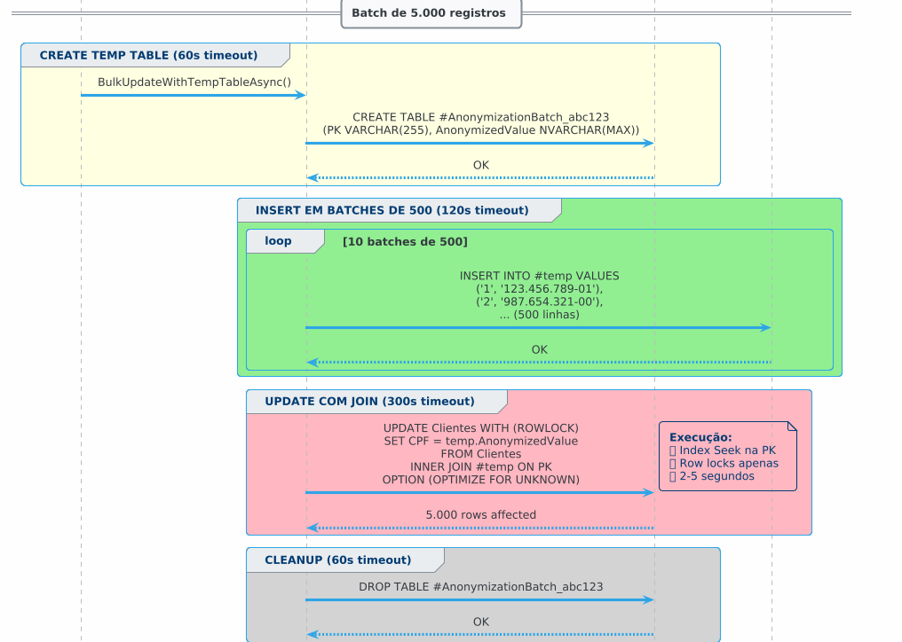

# SQL Data Anonymizer

### Fluxo de Processamento


## Como Funciona

1. Cliente envia requisição POST para `/api/anonymization/start`
2. Controller cria um Job e retorna HTTP 202 (Accepted)
3. Job é enfileirado no Channel (bounded queue)
4. Background Worker processa jobs assincronamente
5. Provider específico (SQL/MySQL/Oracle) anonimiza os dados
6. Status é atualizado no MongoDB em tempo real
7. Cliente consulta status via GET `/api/anonymization/status/{jobId}`

## Tecnologias

- **NET 8.0** - Web API
- **Channels** - Fila assíncrona thread-safe
- **MongoDB** - Persistência de jobs
- **Factory Pattern** - Múltiplos bancos de dados
- **Docker Compose** - Ambiente de desenvolvimento

## Executar

```bash
docker-compose up -d
dotnet run --project SqlDataAnonymizer.Api
```